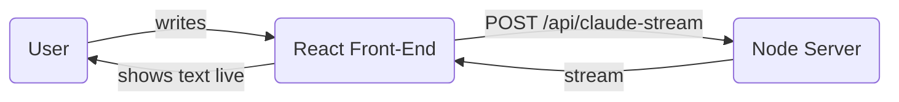

# 🌟 Beginner’s Mini-Tutorial: Build a Real-Time “Claude Chat” in React

> **Goal:** Create a simple webpage where you type a message to Claude and watch its reply appear **letter by letter**—just like live typing.

---

## 1. What You’ll Need
| 👍 Requirement | Why? |
| -------------- | ---- |
| Basic React knowledge | We’ll write a tiny React component. |
| **Claude (Anthropic) API key** | So the back-end can talk to Claude. |
| A React project + small Node/Express server | The front-end shows messages; the back-end streams them. |

---

## 2. How It All Fits Together



* **Front-End:** Text box ✏️ + “Send” button + area to display Claude’s reply.  
* **Back-End:** Receives your text ➜ asks Claude ➜ sends reply back **chunk-by-chunk**.

---

## 3. Front-End Code (React)

Create `ClaudeChat.jsx`:

```jsx
import { useState } from 'react';

export default function ClaudeChat() {
  const [userMsg, setUserMsg] = useState('');
  const [claudeMsg, setClaudeMsg] = useState('');
  const [waiting, setWaiting] = useState(false);

  async function talkToClaude() {
    setClaudeMsg('');
    setWaiting(true);

    try {
      const res = await fetch('/api/claude-stream', {
        method: 'POST',
        headers: { 'Content-Type': 'application/json' },
        body: JSON.stringify({ prompt: userMsg || 'Tell me a fun fact!' })
      });

      if (!res.ok) throw new Error(`Status ${res.status}`);

      const reader = res.body.getReader();
      const decoder = new TextDecoder();

      while (true) {
        const { done, value } = await reader.read();
        if (done) break;
        setClaudeMsg(prev => prev + decoder.decode(value));
      }
    } catch (err) {
      setClaudeMsg('⚠️ Oops—something went wrong.');
      console.error(err);
    } finally {
      setWaiting(false);
    }
  }

  return (
    <div className="max-w-xl mx-auto p-6">
      <h2 className="text-2xl font-bold mb-4">Chat with Claude</h2>

      <textarea
        value={userMsg}
        onChange={e => setUserMsg(e.target.value)}
        placeholder="Type your message..."
        rows={3}
        className="w-full border p-3 rounded mb-3"
      />

      <button
        onClick={talkToClaude}
        disabled={waiting}
        className={\`px-4 py-2 rounded text-white \${waiting ? 'bg-gray-400' : 'bg-purple-600 hover:bg-purple-700'}\`}
      >
        {waiting ? 'Claude is typing…' : 'Send'}
      </button>

      <div className="border rounded p-4 mt-4 min-h-32 bg-gray-50">
        {claudeMsg || <span className="text-gray-400">Claude’s reply appears here…</span>}
      </div>
    </div>
  );
}
```

Add it to your main page (`App.jsx`):

```jsx
import ClaudeChat from './components/ClaudeChat';

function App() {
  return (
    <div className="min-h-screen bg-gray-100">
      <header className="bg-purple-700 text-white py-4 text-center shadow">
        <h1 className="text-3xl font-semibold">My Claude Chat App</h1>
      </header>
      <main className="py-8">
        <ClaudeChat />
      </main>
    </div>
  );
}

export default App;
```

---

## 4. Back-End Code (Node + Express)

Create `server.js`:

```js
import express from 'express';
import dotenv from 'dotenv';
import fetch from 'node-fetch';      // npm install node-fetch@3
dotenv.config();

const app = express();
const PORT = process.env.PORT || 3001;
app.use(express.json());

// 🔑 Put ANTHROPIC_API_KEY=<your key> in a .env file
app.post('/api/claude-stream', async (req, res) => {
  const { prompt } = req.body;
  if (!prompt) return res.status(400).json({ error: 'Prompt required' });

  res.setHeader('Content-Type', 'text/plain');
  res.setHeader('Transfer-Encoding', 'chunked');

  try {
    const apiRes = await fetch('https://api.anthropic.com/v1/messages', {
      method: 'POST',
      headers: {
        'Content-Type': 'application/json',
        'x-api-key': process.env.ANTHROPIC_API_KEY,
        'anthropic-version': '2023-06-01'
      },
      body: JSON.stringify({
        model: 'claude-3-opus-20240229',
        stream: true,
        max_tokens: 1000,
        messages: [{ role: 'user', content: prompt }]
      })
    });

    if (!apiRes.ok) throw new Error(\`Claude error \${apiRes.status}\`);

    const reader = apiRes.body.getReader();
    const decoder = new TextDecoder();

    while (true) {
      const { done, value } = await reader.read();
      if (done) break;

      const chunk = decoder.decode(value);
      for (const line of chunk.split('\n').filter(l => l.startsWith('data:'))) {
        const data = line.replace('data:', '').trim();
        if (data === '[DONE]') continue;

        const json = JSON.parse(data);
        const text = json.delta?.text ?? '';
        if (text) res.write(text);
      }
    }
    res.end();
  } catch (err) {
    console.error(err);
    res.status(500).end('Server error');
  }
});

app.listen(PORT, () => console.log(\`🟢 Server running on \${PORT}\`));
```

---

## 5. Run It!

1. `npm install express dotenv node-fetch`
2. Create `.env` ➜ `ANTHROPIC_API_KEY=your_api_key_here`
3. `node server.js` (back‑end)  
4. `npm start` (React front‑end)

---

## 6. How It Feels

1. You send a message ➜  
2. The server streams Claude’s answer back **piece by piece** ➜  
3. Your page updates live—looks like Claude is typing!

---

*Follow me for more beginner‑friendly AI coding guides!* 🚀
