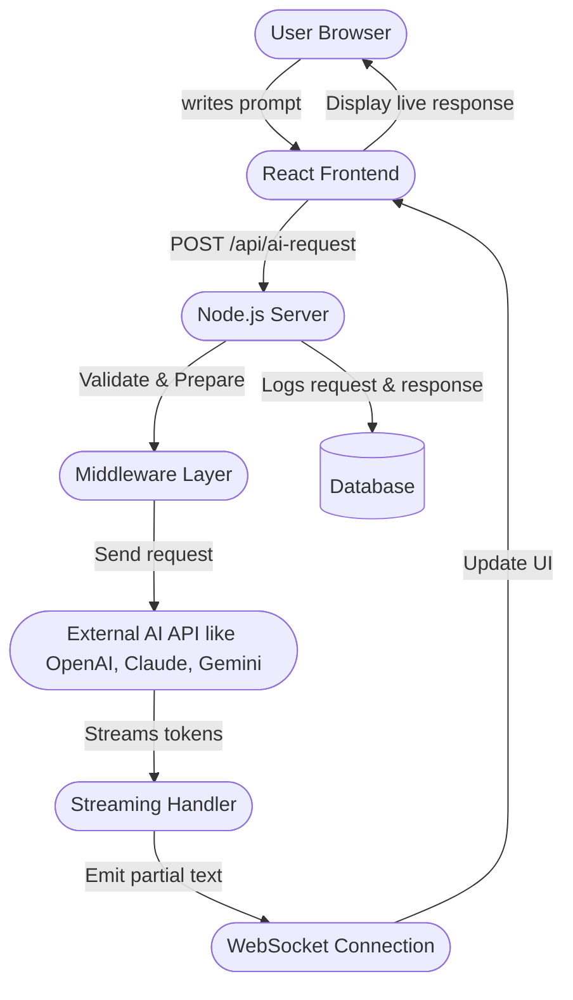

# 🌟 Beginner’s Guide: How a Simple AI Frontend Wrapper Works

This guide explains how a basic AI app — like a chatbot or a content generator — actually works behind the scenes, based on this simple flow:



---

## 🔵 Step-by-Step Explanation

### 1. 🧑‍💻 User Types a Prompt
The user types a message (like "Tell me a fun fact") in the web browser.

---

### 2. ⚛️ React Frontend Sends a Request
The React app captures the user’s message and sends it to the server using a POST request:
```
POST /api/ai-request
```

---

### 3. 🚀 Node.js Backend Receives the Request
The backend (typically a small Express server) accepts the incoming message.

---

### 4. 🛡️ Middleware Layer Validates
Before contacting the AI provider:
- It checks if the message is valid (not empty, not abusive, etc.).
- It may also attach extra info like user ID or API usage limits.

---

### 5. 🌍 Backend Calls External AI API
The backend sends the message to an external AI API, such as:
- [OpenAI](https://openai.com)
- Anthropic Claude
- Google Gemini

It asks for a **streamed** response instead of waiting for the whole reply at once.

---

### 6. ⏳ AI API Streams Tokens
The AI service doesn't wait to finish the full answer — it **streams tokens** (pieces of text) back immediately as it generates them.

---

### 7. 🔁 Streaming Handler Processes Incoming Text
A special handler reads each incoming piece of text:
- Converts it to readable text
- Prepares it to be shown in real-time

---

### 8. 🔗 WebSocket Sends Live Updates
Instead of refreshing the page, a **WebSocket connection** pushes each new text piece live to the user’s browser.

This creates that "AI is typing..." feeling!

---

### 9. 🎯 Frontend Updates the UI in Real-Time
React takes each new incoming piece and updates the displayed text immediately so the user sees the AI’s reply grow letter by letter.

---

### 10. 📜 Backend Logs Everything
For security, analytics, or billing purposes:
- The backend saves the prompt, the AI response, and metadata (like timestamps) into a database.

---

## 🧠 Why This Architecture?
- **Speed:** Streaming makes it *feel* instant.
- **Scalability:** Middleware and logs help manage users safely.
- **Flexibility:** Easy to swap AI providers if needed.
- **Real-time UX:** WebSockets create smooth, natural interactions.

---

## 🚀 Real-World Bonus Tips
- Add a timeout in case the AI gets stuck.
- Show a blinking typing cursor while waiting.
- Allow users to cancel a request mid-stream.
- Monitor database size if you log everything.

---

**Follow for more beginner-friendly AI project guides!** 🚀
