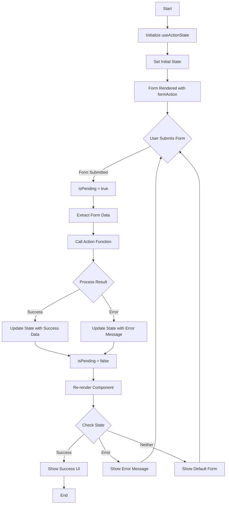

```mermaid
graph TD
    A[Start] --> B[Initialize useActionState]
    B --> C[Set Initial State]
    
    C --> D[Form Rendered with formAction]
    
    D --> E{User Submits Form}
    E --> |Form Submitted| F[isPending = true]
    F --> G[Extract Form Data]
    G --> H[Call Action Function]
    
    H --> I{Process Result}
    I --> |Success| J[Update State with Success Data]
    I --> |Error| K[Update State with Error Message]
    
    J --> L[isPending = false]
    K --> L
    
    L --> M[Re-render Component]
    M --> N{Check State}
    
    N --> |Success| O[Show Success UI]
    N --> |Error| P[Show Error Message]
    N --> |Neither| Q[Show Default Form]
    
    O --> R[End]
    P --> E
    Q --> E
```
