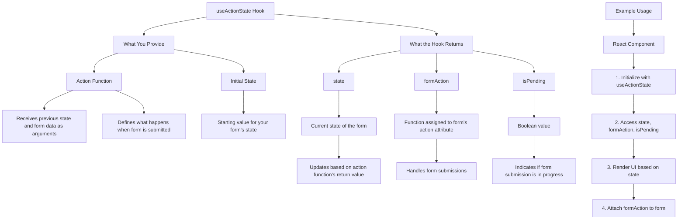

```mermaid
graph TD
    A[useActionState Hook] --> B[What You Provide]
    B --> C[Action Function]
    B --> D[Initial State]
    
    C --> C1[Receives previous state and form data as arguments]
    C --> C2[Defines what happens when form is submitted]
    
    D --> D1[Starting value for your form's state]
    
    A --> E[What the Hook Returns]
    E --> F[state]
    E --> G[formAction]
    E --> H[isPending]
    
    F --> F1[Current state of the form]
    F1 --> F2[Updates based on action function's return value]
    
    G --> G1[Function assigned to form's action attribute]
    G1 --> G2[Handles form submissions]
    
    H --> H1[Boolean value]
    H1 --> H2[Indicates if form submission is in progress]
    
    I[Example Usage] --> J[React Component]
    J --> K[1. Initialize with useActionState]
    K --> L[2. Access state, formAction, isPending]
    L --> M[3. Render UI based on state]
    M --> N[4. Attach formAction to form]

```
